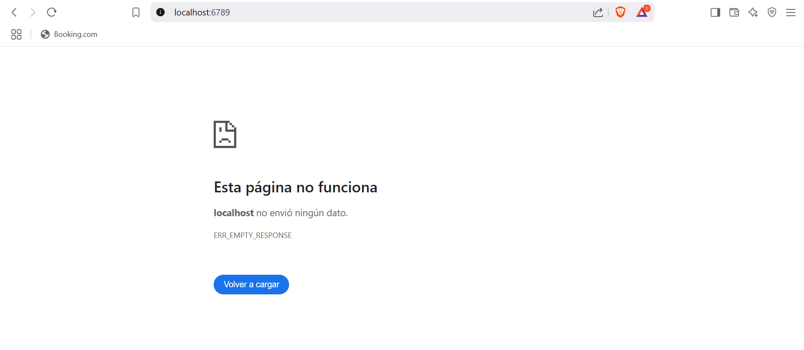
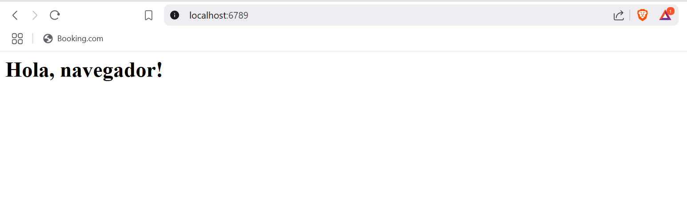
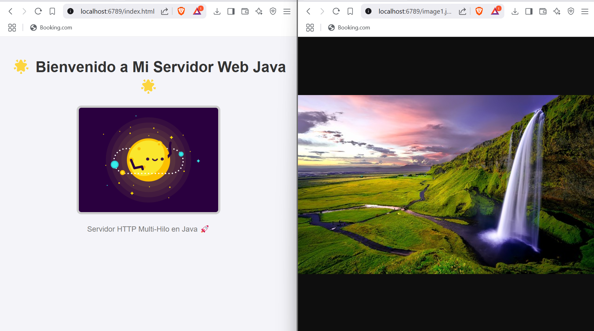
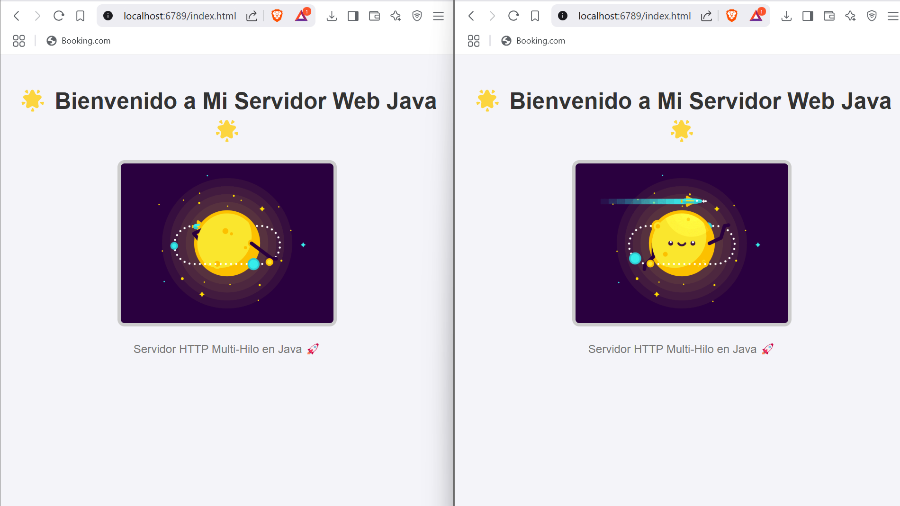
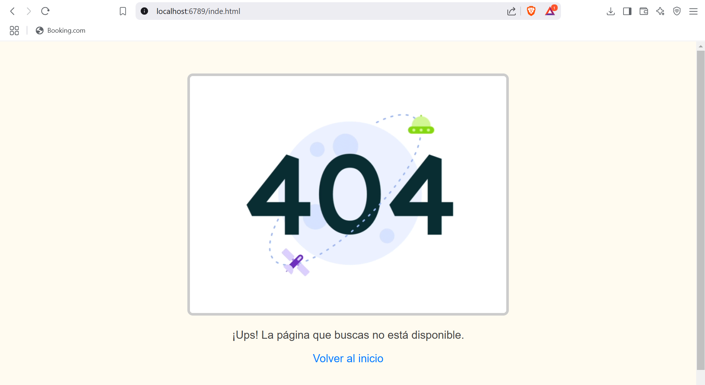
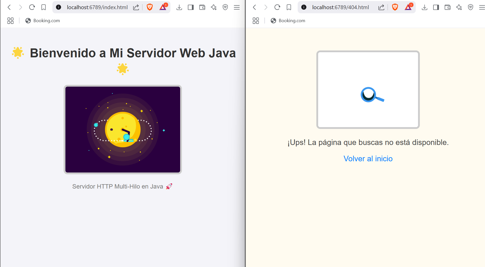

# 🌐 Simple Multi-threaded HTTP Server in Java 🚀

## 📋 Overview
This project is a basic multi-threaded HTTP server implemented in Java. The server processes HTTP requests, serves static files (like HTML, images, and GIFs), and handles 404 errors for missing resources.

## 🔨 Development Phases

### **Phase 1: Basic Server Setup**
- **Initial Version:** The server was able to accept connections but did not send any response.

  

- **Improved Version:** Implemented response handling, sending basic HTTP status codes and simple HTML responses.

  

### **Phase 2: Serving Static Files**
- The server can now serve HTML pages, images (JPEG, PNG, GIF), and handle requests for missing files with a custom 404 page.
- The `index.html` displays a GIF, and the `404.html` shows a custom 404 GIF.

  
  
  
  

## ⚙️ How It Works
1. The server listens on **port 6789** for incoming connections.
2. Each client connection is handled in a separate thread using the `Runnable` interface.
3. The server parses HTTP GET requests to determine the requested file.
4. If the file exists, it's served with the correct `Content-Type`.
5. If the file is missing, a custom 404 error page is returned.

## 🚀 How to Compile & Run

### **Prerequisites:**
- Java Development Kit (JDK) installed.
- Maven (if managing dependencies).

### **Steps:**
1. **Clone the repository:**
   ```bash
   git clone <repository-url>
   cd <project-directory>
   ```

2. **Compile the project:**
   ```bash
   javac -d out src/main/java/org/example/*.java
   ```

3. **Run the server:**
   ```bash
   java -cp out org.example.ServidorHTTP
   ```

4. **Access the server:**
   Open your browser and go to [http://localhost:6789](http://localhost:6789)

## 📁 Project Structure
```
├── src
│   └── main
│       └── java
│           └── org
│               └── example
│                   ├── ServidorWeb.java
│                   └── SolicitudHttp.java
└── resources
    ├── index.html
    ├── 404.html
    ├── gif1.gif
    └── 404.gif
```

## 💡 Notes
- Make sure your `index.html` and `404.html` are placed in the `resources` folder.
- To change the port, modify the server initialization code in `ServidorWeb.java`.

Enjoy your lightweight Java HTTP server! 😄🌍

